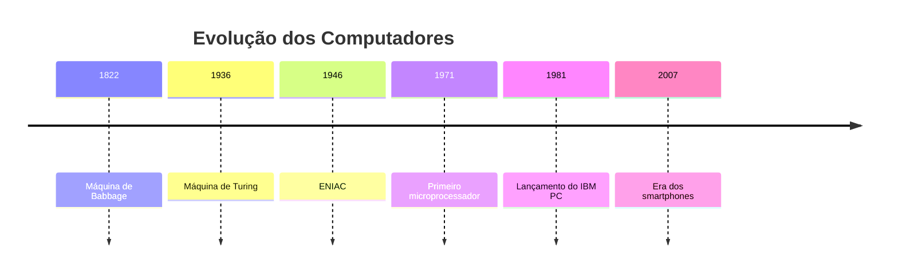

> O computador é uma das invenções mais impactantes da história moderna.
{: .prompt-info }

## O que é um computador?

Um **computador** é uma máquina capaz de receber, processar e armazenar dados, permitindo a execução de tarefas complexas de forma automatizada.

Ele é composto, basicamente, por **hardware** (a parte física) e **software** (os programas que rodam na máquina).

## Breve história

A ideia de um computador vem de muito antes da era digital. Veja a linha do tempo abaixo:

## Principais componentes

- **Processador (CPU)**: o "cérebro" do computador.
- **Memória RAM**: armazenamento temporário de dados.
- **HD/SSD**: armazenamento permanente.
- **Placa-mãe**: interliga todos os componentes.
- **Sistema operacional**: interface entre usuário e máquina.

{: w="700" h="400" .shadow }

## Computadores modernos

Hoje, os computadores vão muito além dos desktops. Estão em:

- Smartphones
- Tablets
- Smart TVs
- Relógios inteligentes
- Carros

> A computação está em todo lugar – até em dispositivos que nem imaginamos.
{: .prompt-tip }

## Considerações finais

A evolução dos computadores segue em ritmo acelerado, impulsionando áreas como **inteligência artificial**, **realidade aumentada** e **internet das coisas (IoT)**.

---

Se você gostou deste conteúdo, compartilhe ou deixe um comentário abaixo!

